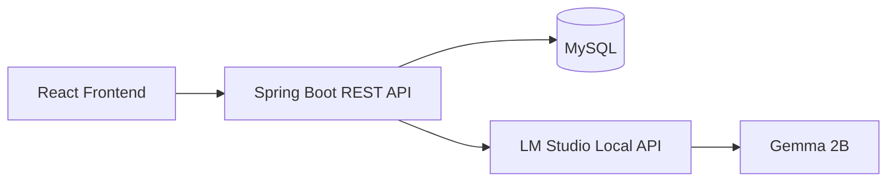

# CampusMart AI – Student Essentials Marketplace

A full-stack college-student marketplace built with React, Java Spring Boot, MySQL and a real local LM Studio/Gemma 2B integration.

## Features
- Student registration, login, college-email verification flow and role-based access
- Product buy/sell/exchange/donate listings
- Search, category/condition/price filters and sorting
- Cart, wishlist and checkout
- Order history and status management
- Buyer/seller messaging
- Admin dashboard with marketplace statistics and management
- AI recommendations using only products retrieved by the backend
- Responsive professional UI
- Validation, structured errors, CORS and password hashing

## Architecture


## Requirements
- Java 17+
- Maven 3.9+
- Node.js 18+
- MySQL 8+
- Optional for AI: LM Studio with Gemma 2B loaded and its local server enabled

## Run
### 1. Database
Create a MySQL database:
```sql
CREATE DATABASE campusmart;
```
Then update `backend/src/main/resources/application.properties` or environment variables.

### 2. Backend
```bash
cd backend
mvn spring-boot:run
```
API: `http://localhost:8080`

### 3. Frontend
```bash
cd frontend
npm install
npm run dev
```
Frontend: `http://localhost:5173`

### Demo accounts
- Admin: `admin@campusmart.local` / `Admin@123`
- Student: `student@campus.local` / `Student@123`

The seed student account is already verified. New registrations use a development verification-code flow so the project works without an SMTP server. In production, replace that flow with a real college-email provider.

### AI
In LM Studio, load Gemma 2B and start the local OpenAI-compatible server on `http://localhost:1234`. The backend calls `/v1/chat/completions`. AI never writes to the database and receives only the relevant product context selected by the backend.

## API
Auth: `POST /api/auth/register`, `POST /api/auth/login`, `POST /api/auth/verify`
Products: `GET/POST/PUT/DELETE /api/products`, `GET /api/products/search`
Cart: `GET/POST/PUT/DELETE /api/cart`
Wishlist: `GET/POST/DELETE /api/wishlist`
Orders: `POST /api/orders`, `GET /api/orders`, `GET /api/orders/{id}`
Messages: `GET/POST /api/messages`
AI: `POST /api/ai/recommend`
Admin: `GET /api/admin/stats`, `GET /api/admin/users`, `PUT /api/admin/orders/{id}/status`

## Security
Passwords are BCrypt-hashed. APIs use JWT bearer authentication and role checks. Secrets/database credentials are environment-driven. JPA parameter binding protects database queries from SQL injection.

## Author
Aswin Raj D
